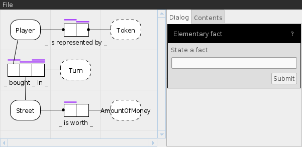

Orm Prototyper
=========

This application is designed to develop protypes of ORM (Object Role Model) diagrams. The target audience are non-technical domain experts. It uses the paragigm of dialog games to guide the user in providing domain knowledge without having to be an expert in ORM.

This project is part of my master thesis, which will soon be provided in this repository.

Building and running
--------
The project is using maven so it should be pretty easy to build it yourself. To make it even easier, the steps are written down below.

    # Get the code
    $ git clone https://github.com/jdtimmerman/orm-prototyper.git
    
    # Build the project
    $ cd orm-prototyper
    $ mvn clean package
    
    # Start the application
    $ java -jar OrmViewBatik/target/OrmPrototyper.jar

The application supports a couple of arguments

	java -jar OrmPrototyper.jar [locale] [debug-level] [insertDemoData]
		locale        	Start with the given locale (e.g. nl_NL or en_US)
		debug-level   	Log with the given level (e.g. warn, debug, info) 
		insertDemoData	Insert an example diagram (any strings flags this value as true)

There is no user guide, the application should be fairly straight-forward for anyone with a bit of knowledge about ORM. Don't let your domain experts using this without any explanation though (read the thesis to know why).

Screenshot
----

Development
----
This project is open source, you can use any of it under the GPLv3 license.
